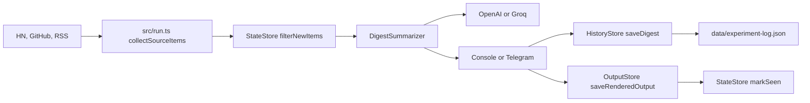

# Architecture

This document describes the current system as implemented.

## System Summary

- Runtime: Node.js 20+ with TypeScript ESM.
- Package manager: `pnpm`.
- Primary datastore: local JSON files under `data/`.
- External services: Hacker News API, GitHub search API, RSS feeds, OpenAI or Groq, optional Telegram.
- Deployment model: local/manual execution or cron.

## Data Flow

## Components

| Component | Responsibility | Owns Data | Notes |
| --- | --- | --- | --- |
| `src/index.ts` | Main orchestration for one radar run | No | Owns ordering guarantees across collection, summarization, delivery, history, and dedupe. |
| `src/run.ts` | Source collection and partial/all-source failure semantics | No | Throws only when every source fails. |
| `src/sources/*` | Fetch raw candidate items | No | External APIs should be treated as unreliable. |
| `src/summarizer.ts` | Prompt and structured digest schema | No | Must keep output action-oriented and schema-valid. |
| `src/llm/*` | Provider implementations | No | Currently supports OpenAI and Groq only. |
| `src/deliveries/*` | Console and Telegram delivery | No | Telegram failure is recorded, not fatal after persistence. |
| `src/history/store.ts` | Digest history and experiment log persistence | Yes | Writes local JSON and creates accountability entries. |
| `src/history/output-store.ts` | Rendered output persistence | Yes | Writes timestamped human-readable digest text. |
| `src/utils/state.ts` | Dedupe state | Yes | Marks seen items after persistence succeeds. |
| `src/cli/*` | Local review and outcome logging | Yes | Must not require provider credentials. |

## Storage Contracts

| File | Purpose | Writer | Notes |
| --- | --- | --- | --- |
| `data/state.json` | Seen source item IDs | `StateStore` | Local runtime data. |
| `data/history/<runId>.json` | Completed digest record | `HistoryStore.saveDigest()` | Includes source and delivery status when produced by current code. |
| `data/outputs/<runId>.txt` | Rendered human-readable digest output | `OutputStore.saveRenderedOutput()` | Includes run ID, digest generated timestamp, output rendered timestamp, and formatted digest text. |
| `data/experiment-log.json` | Follow-up accountability ledger | `HistoryStore` and `log-action` CLI | One entry per completed digest run. |

## Configuration

Configuration is read from environment variables in `src/config.ts`. Local runs can use `.env` through Node's `--env-file-if-exists=.env` flag.

Provider support is limited to:

- `LLM_PROVIDER=openai` with `OPENAI_API_KEY`
- `LLM_PROVIDER=groq` with `GROQ_API_KEY`

Rendered output logs default to `OUTPUT_LOG_DIR=./data/outputs`.

Do not document a provider as supported until it is wired into `src/llm/provider.ts`, configured in `src/config.ts`, documented in `.env.example`, and covered by tests.

## Fragile Areas

| Area | Risk | Mitigation |
| --- | --- | --- |
| Run ordering | Marking items seen before persistence would lose candidates after a failed run. | Preserve current ordering and add regression tests for changes. |
| File-backed persistence | Partial writes could corrupt local JSON. | Keep writes small; consider atomic writes only if corruption appears. |
| Provider JSON schema support | Different models handle schema output differently. | Keep provider tests and default to models known to support structured output. |
| Source APIs | Network failures can look like no new signals. | Preserve all-source failure behavior and partial-failure records. |
